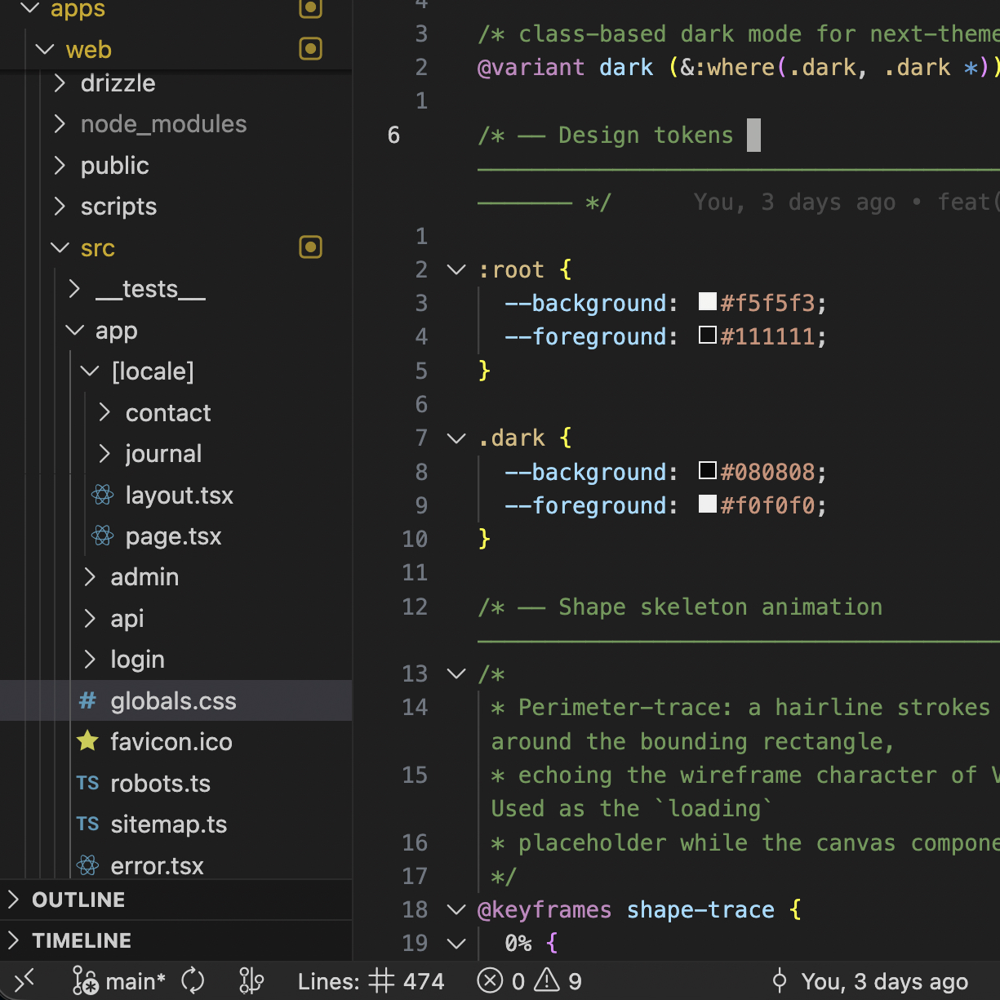
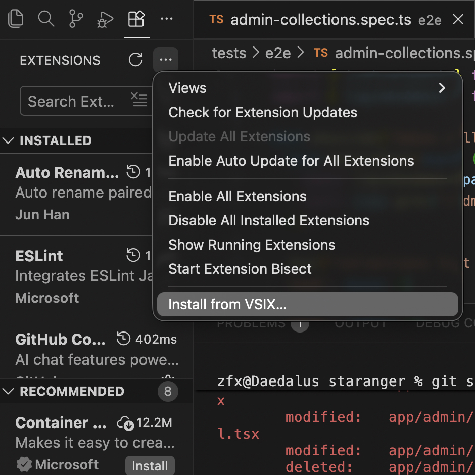

# Line Count Status Bar Extension

A lightweight VS Code extension that displays the total line count of the current file in the status bar.



## Features

- Shows total line count in status bar
- Configurable display format with icons
- Configurable alignment (left/right)
- Real-time updates as you edit
- Lightweight and fast

## Configuration

You can customize the extension through VS Code settings:

```json
{
  "lineCount.showInStatusBar": true,
  "lineCount.format": "Lines: $(symbol-number) {count}",
  "lineCount.alignment": "left",
  "lineCount.priority": 100
}
```

### Settings

- `lineCount.showInStatusBar`: Enable/disable the line count display
- `lineCount.format`: Format string (use `{count}` for the actual number)
- `lineCount.alignment`: Status bar alignment (`left` or `right`)
- `lineCount.priority`: Status bar item priority (higher = more left)

## Installation

Install from VSIX:

1. Download the `.vsix` file
2. Run `code --install-extension line-count-statusbar-1.0.0.vsix`

Or install via VsCode UI:



## Development

```bash
# Install dependencies
npm install

# Compile TypeScript
npm run compile

# Watch for changes
npm run watch
```

## License

MIT
